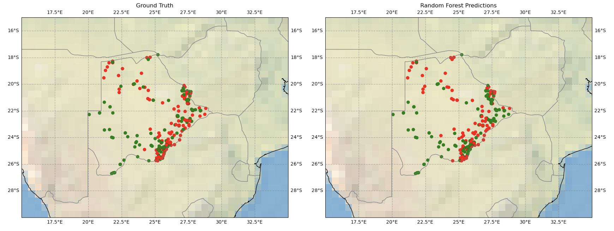
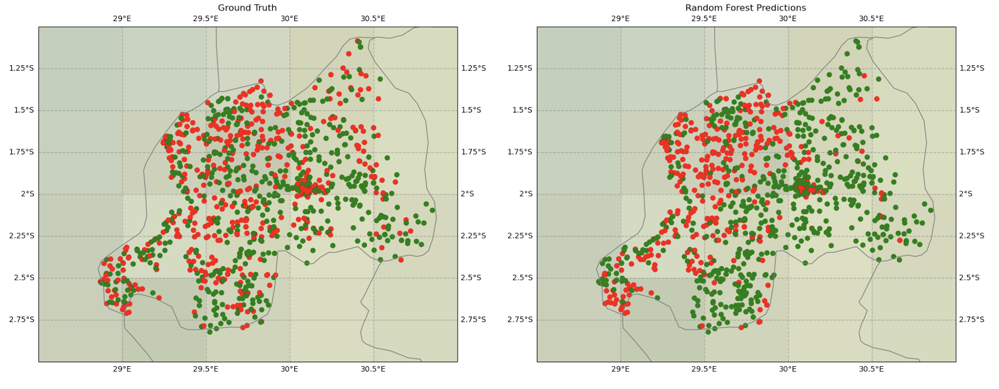
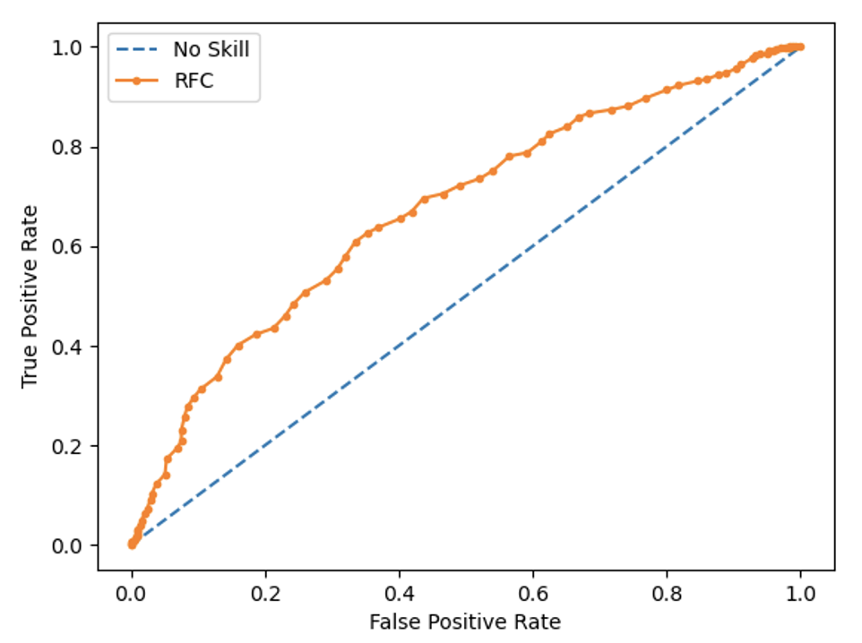
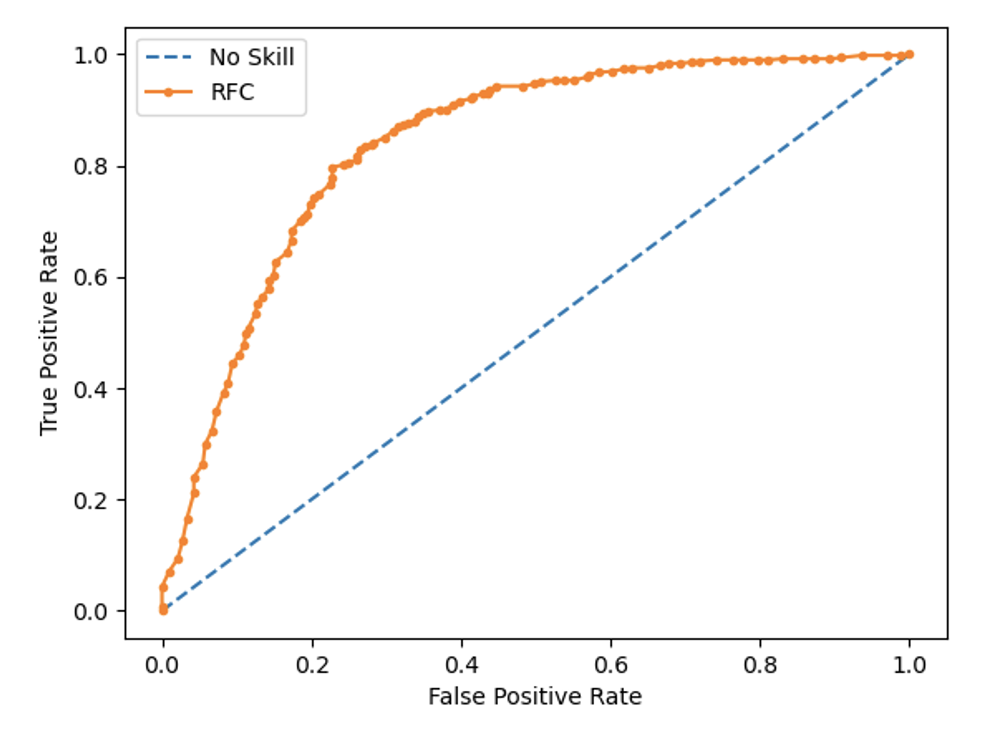
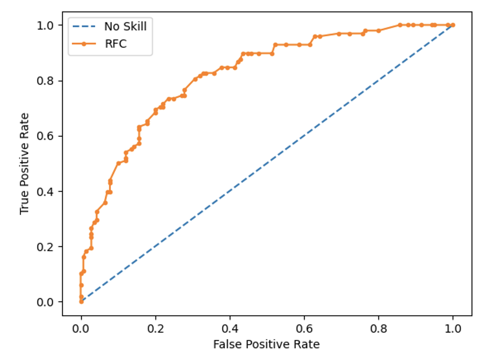
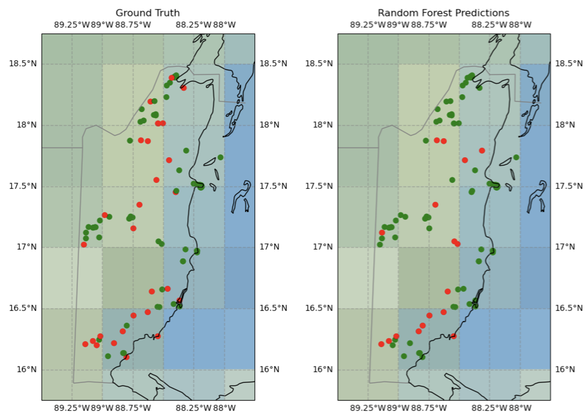

* [Introduction](#introduction)
* [Dataset](#dataset)
* [Data Processing](#data-processing)
* [Model](#model)
* [Results](#results)


# Introduction
This project develops Machine Learning models to predict binary connectivity of schools to the internet. The models are trained on a combination of UN-provided survey data and open-source remote sensing data. This work is in support of UNICEF's [Giga](https://giga.global/) initiative to connect every child to the internet by 2030.

# Dataset  
### Google Earth Engine
#### [MODIS Landcover](https://developers.google.com/earth-engine/datasets/catalog/MODIS_061_MCD12Q1)
Landcover data from MCD12Q1.061 MODIS Land Cover Type Yearly Global 500m. 500m resolution, Land Cover Type 1: Annual International Geosphere-Biosphere Programme (IGBP) classification scheme used. Data taken from 2020.

| Feature      | Description                        |
| ---------- | -----------------------------------  |
| `modis.LC_Type1.mode`     | Mode of landcover classes            |
| `modis.LC_Type1.var` | Variance of landcover                |
| `modis.LC_Type1.evg_conif` | Percent coverage of Evergreen Needleleaf Forests Class: dominated by evergreen conifer trees (canopy >2m). Tree cover >60% |
| `modis.LC_Type1.evg_broad` | Percent coverage of Evergreen Broadleaf Forests Class: dominated by evergreen broadleaf and palmate trees (canopy >2m). Tree cover >60%. |
| `modis.LC_Type1.dcd_needle` | Percent coverage of Deciduous Needleleaf Forests Class: dominated by deciduous needleleaf (larch) trees (canopy >2m). Tree cover >60%. |
| `modis.LC_Type1.dcd_broad` | Percent covereage of Deciduous Broadleaf Forests Class: dominated by deciduous broadleaf trees (canopy >2m). Tree cover >60%. | 
| `modis.LC_Type1.mix_forest` | Percent coverage of Mixed Forests Class: dominated by neither deciduous nor evergreen (40-60% of each) tree type (canopy >2m). Tree cover >60%. |
| `modis.LC_Type1.cls_shrub` | Percent coverage of Closed Shrublands Class: dominated by woody perennials (1-2m height) >60% cover. | 
| `modis.LC_Type1.open_shrub` | Percent coverage of Open Shrublands Class: dominated by woody perennials (1-2m height) 10-60% cover. | 
| `modis.LC_Type1.woody_savanna` | Percent coverage of Woody Savannas Class: tree cover 30-60% (canopy >2m). |
| `modis.LC_Type1.savanna` | Percent coverage of Savannas Class: tree cover 10-30% (canopy >2m). | 
| `modis.LC_Type1.grassland` | Percent coverage of Grasslands Class: dominated by herbaceous annuals (<2m). |
| `modis.LC_Type1.perm_wetland` | Percent coverage of Permanent Wetlands Class: permanently inundated lands with 30-60% water cover and >10% vegetated cover. |
| `modis.LC_Type1.cropland` | Percent coverage of Croplands Class: at least 60% of area is cultivated cropland. | 
| `modis.LC_Type1.urban` | Percent coverage of Urban and Built-up Lands Class: at least 30% impervious surface area including building materials, asphalt and vehicles. | 
| `modis.LC_Type1.crop_nat_veg` | Percent coverage of Cropland/Natural Vegetation Mosaics Class: mosaics of small-scale cultivation 40-60% with natural tree, shrub, or herbaceous vegetation. |
| `modis.LC_Type1.perm_snow` | Percent coverage of Permanent Snow and Ice Class: at least 60% of area is covered by snow and ice for at least 10 months of the year. | 
| `modis.LC_Type1.barren` | Percent coverage of Barren Class: at least 60% of area is non-vegetated barren (sand, rock, soil) areas with less than 10% vegetation. |
| `modis.LC_Type1.water_bds` | Percent coverage of Water Bodies Class: at least 60% of area is covered by permanent water bodies.|

#### [Gridded Population of the World Version 4.11](https://developers.google.com/earth-engine/datasets/catalog/CIESIN_GPWv411_GPW_Population_Density#bands)
The Gridded Population of World Version 4 (GPWv4), Revision 11 models the distribution of global human population for the years 2000, 2005, 2010, 2015, and 2020 on 30 arc-second (approximately 1km) grid cells. Resolution: 927.67 meters. Data taken from 2020.

| Feature      | Description                        |
| ---------- | -----------------------------------  |
| `pop.population_density.var`     | Variance of population in grid cell |
| `pop.population_density.mean`     | Mean of population in grid cell |
| `pop.population_density.max`     | Maximum of population in grid cell |
| `pop.population_density.min`     | Minimum of population in grid cell |

#### [GHSL: Global Human Settlement Layers, Built-Up Characteristics 2018](https://developers.google.com/earth-engine/datasets/catalog/JRC_GHSL_P2023A_GHS_BUILT_C)
The GHS-BUILT-C spatial raster dataset delineates the boundaries of the human settlements at 10m pixel size and describes their inner characteristics in terms of the morphology of the built environment and the functional use.

| Feature      | Description                        |
| ---------- | -----------------------------------  |
| `human_settlement_layer_built_up.built_characteristics.mode`     | Mode of Human Settlement Layer Built Up Characteristics            |
| `human_settlement_layer_built_up.built_characteristics.var`     | Variance of Human Settlement Layer Built Up Characteristics            |
| `human_settlement_layer_built_up.built_characteristics.open_low_veg`     | Percent coverage of open spaces, low vegetation surfaces class|
| `human_settlement_layer_built_up.built_characteristics.open_med_veg`     | Percent coverage of open spaces, medium vegetation surfaces class|
| `human_settlement_layer_built_up.built_characteristics.open_high_veg ` | Percent coverage of open spaces, high vegetation surfaces class |
| `human_settlement_layer_built_up.built_characteristics.open_water` | Percent coverage of open spaces, water surfaces class |
| `human_settlement_layer_built_up.built_characteristics.open_road` | Percent coverage of open spaces, road surfaces class |
| `human_settlement_layer_built_up.built_characteristics.built_res_3` | Percent coverage of built spaces, residential, building height <= 3m class |
| `human_settlement_layer_built_up.built_characteristics.built_res_3-6` | Percent coverage of built spaces, residential, 3m < building height <= 6m class |
| `human_settlement_layer_built_up.built_characteristics.built_res_6-15` | Percent coverage of built spaces, residential, 6m < building height <= 15m class | 
| `human_settlement_layer_built_up.built_characteristics.built_res_15-30` | Percent coverage of built spaces, residential, 15m < building height <= 30m class | 
| `human_settlement_layer_built_up.built_characteristics.built_res_30` | Percent coverage of built spaces, residential, building height > 30m class |
| `human_settlement_layer_built_up.built_characteristics.built_non_res_3` | Percent coverage of built spaces, non-residential, building height <= 3m class | 
| `human_settlement_layer_built_up.built_characteristics.built_non_res_3-6` | Percent coverage of built spaces, non-residential, 3m < building height <= 6m class |
| `human_settlement_layer_built_up.built_characteristics.built_non_res_6-15` | Percent coverage of built spaces, non-residential, 6m < building height <= 15m | 
| `human_settlement_layer_built_up.built_characteristics.built_non_res_15-30` | Percent coverage of built spaces, non-residential, 15m < building height <= 30m class |
| `human_settlement_layer_built_up.built_characteristics.build_non_res_30` | Percent coverage of built spaces, non-residential, building height > 30m |

#### [Global Human Modification](https://developers.google.com/earth-engine/datasets/catalog/CSP_HM_GlobalHumanModification)
The global Human Modification dataset (gHM) provides a cumulative measure of human modification of terrestrial lands globally at 1 square-kilometer resolution.

| Feature      | Description                        |
| ---------- | -----------------------------------  |
| `global_human_modification.gHM.mode` | Mode of gHM in grid cell |
| `global_human_modification.gHM.var` | Variance of gHM in grid cell |
| `global_human_modification.gHM.mean` | Average of gHM in grid cell |
| `global_human_modification.gHM.max` | Maximum value of gHM in grid cell |
| `global_human_modification.gHM.min` | Minimum value of gHM in grid cell |

#### [VIIRS Nightlight](https://developers.google.com/earth-engine/datasets/catalog/NOAA_VIIRS_DNB_MONTHLY_V1_VCMCFG)
Monthly average radiance composite images using nighttime data from the Visible Infrared Imaging Radiometer Suite (VIIRS) Day/Night Band (DNB).

| Feature      | Description                        |
| ---------- | -----------------------------------  |
| `nightlight.avg_rad.mean` | Average DNB radiance values (nanoWatts/sr/cm^2) in grid cell |
| `nightlight.avg_rad.var` | Variance of DNB radiance values (nanoWatts/sr/cm^2) in grid cell |
| `nightlight.avg_rad.max` | Maximum DNB radiance value (nanoWatts/sr/cm^2) in grid cell | 
| `nightlight.avg_rad.min` | Minimum DNB radiance value (nanoWatts/sr/cm^2) in grid cell |
| `nightlight.cf_cvg.mean` | Average Cloud-free coverages; the total number of observations that went into each pixel values in grid cell |
| `nightlight.cf_cvg.var` | Variance of Cloud-free coverages; the total number of observations that went into each pixel values in grid cell |
| `nightlight.cf_cvg.max` | Maximum Cloud-free coverages; the total number of observations that went into each pixel values in grid cell | 
| `nightlight.cf_cvg.min` | Minimum Cloud-free coverages; the total number of observations that went into each pixel values in grid cell |

### Other Sources

#### [Electrical Power Grid Information](https://energydata.info/dataset/derived-map-global-electricity-transmission-and-distribution-lines)
Vectorized predicted distribution and transmission line network data per country was downloaded from the global results from gridfinder model, produced by ESMAP based on joint work with Facebook and others via the Derived map of global electricity transmission and distribution lines product.

| Feature      | Description                        |
| ---------- | -----------------------------------  |
| `distance_to_transmission_line_network` | Distance of transmission line to school in radians |

#### UNICEF Database
The UNICEF Giga Database provides school information including location, connectivity status, and more. 

| Feature      | Description                        |
| ---------- | -----------------------------------  |
| `education_type` | Education level of school. One of, or a combination of Pre-primary, Primary, Secondary, Post-Secondary and Other. |

#### [Speedtest by Ookla Global Fixed and Mobile Network Performance Maps](https://registry.opendata.aws/speedtest-global-performance/)
Ookla provides freely available global fixed broadband and mobile (cellular) network performance data of zoom level 16 web mercator tiles (approximately 610.8m x 610.8m at the equator). Download speed, upload speed and latency data are collected via Speedtest by Ookla applications for Androis and iOS and averaged for each tile, and measurements are filtered to results containing GPS-quality location accuracy.

| Feature      | Description                        |
| ---------- | -----------------------------------  |
| `avg_d_kbps_mobile` | Average download speed of all mobile tests performed in the nearest tile (kilobits per second) |
| `avg_u_kbps_mobile` | Average upload speed of all mobile tests performed in the nearest tile (kilobits per second) |
| `avg_lat_ms_mobile` | Average latency of all mobile tests perfomed in the nerarest tile (milliseconds) |
| `tests_mobile` | Number of mobile tests taken in the nearest tile | 
| `devices_mobile` | Number of unique mobile devices in the nearest tile |
| `ookla_distance_mobile` | Distance of the nearest tile to the school location |
| `avg_d_kbps_fixed` | Average download speed of all fixed broadband tests performed in the nearest tile (kilobits per second) |
| `avg_u_kbps_fixed` | Average upload speed of all fixed broadband tests performed in the nearest tile (kilobits per second) |
| `avg_lat_ms_fixed` | Average latency of all fixed broadband tests perfomed in the nerarest tile (milliseconds) |
| `tests_fixed` | Number of fixed broadband tests taken in the nearest tile | 
| `devices_fixed` | Number of unique fixed broadband devices in the nearest tile |
| `ookla_distance_fixed` | Distance of the nearest tile to the school location |


# Data Processing
Open-source data from Google Earth Engine is collected via the [airPy]([https://pages.github.com/](https://github.com/kelsdoerksen/airPy/tree/master)https://github.com/kelsdoerksen/airPy/tree/master). Per latitude, longitude point representing a school location and user-specified AOI buffer extent, GEE data can be extracted and processed to generate statistical features of landcover information from MODIS, VIIRS Nightlight, Human Modification, Human Settlement Built Layer, and World Population data.

|
|:--:| 
| *Figure 1. Example of airPy package processing tool used over Rwanda to extract GEE information* |

#### Distance to Transmission Line
Steps to calculating the distance of school from electrical transmission lines. In QGIS:

| Step | Instruction | QGIS Actions |
| ---- | ----------- | ------------------------------------ |
| 1    | Load [World Bank Official Boundaries](https://datacatalog.worldbank.org/search/dataset/0038272/World-Bank-Official-Boundaries) data and subset for country of interest | Select Countries Layer -> Open Attribute Table -> Select Country of Interest -> Export Selected Layer as New Layer | 
| 2   | Load [Derived map of global electricity transmission and distribution lines](https://energydata.info/dataset/derived-map-global-electricity-transmission-and-distribution-lines) gpkg file and clip to AOI extent | Select Transmission Line Layer -> Vector Overlay: Extract /clip by extent -> Input layer: tranmission line layer, Extent: Country layer |
| 3   | Load csv of school information as new School Locations layer | Layer -> Add Layer -> Add Delimited Text Layer |
| 4   | Calculate distance of school points to nearest transmission line | Select School Locations layer -> Open Attribute Table -> Toggle Editing -> New field (name: distance_to_tranmission_line) -> Open field calculator -> Update existing field (distance_to_transmission_line) -> `length(make_line ($geometry,closest_point (overlay_nearest ('line', $geometry)[0],$geometry)))` |
| 5   | Export modified School Locations layer with new distance information | Select School Locations layer -> Export -> Save |

Figure 1 depicts an example of the school distances from electrical transmission lines in Rwanda. The left side of the figure depicts the entire country, and the right side of the figure highlights a smaller region for more clarity.

|
|:--:| 
| *Figure 1. Example of Distance from Schools to Transmission Lines in Rwanda* |

#### UNICEF Data
`education_level` strings are encoded to integers ranging from 1-9 via the following dictionary:
```
education_level = {
        'Pre-Primary': 0,
        'Primary': 1,
        'Secondary': 2,
        'Pre-Primary and Secondary': 3,
        'Primary and Secondary': 4,
        'Pre-Primary and Primary': 5,
        'Pre-Primary and Primary and Secondary': 6,
        'Pre-Primary, Primary and Secondary': 6,
        'Primary, Secondary and Post-Secondary': 7,
        'Post-Secondary': 8,
        'Other': 9
    }
```

#### Ookla Speedtest data
Similar to the electrical power grid information, per school location provided by UNICEF, the distance to the nearest Ookla tile is calculated and the corresponding metrics from the fixed broadband and mobile networks are included as features. High-level steps are detailed below:

| Step | Instruction |
| ---- | ----------- |
| 1    | Convert UNICEF school geolocations csv file to geojson |
| 2    | Create mask of AOI (specified country) from World Bank boundaries shapefile and save as geojson |
| 3    | Load school locations geojson file to geopandas dataframe |
| 4    | Load Ookla dataset to geopandas dataframe specifying country mask to decrease computation time |
| 5    | Convert crs of school locations and ookla dataframes from EPSG:4326 &rarr; EPSG: 3857* |
| 6    | Use method `geopandas.sjoin_nearest()` function to find the nearest ookla tile per school location |

<sup>*EPSG:3857 uses a mathematical projection to map the Earth’s curved surface onto a flat, two-dimensional, square plane. This is important to be able to calculate the nearest ookla point to the school locations correctly.</sup>


#### Cleaning Data
Data is cleaned by removing duplicate school entries and entries that contain NaNs.

# Model
The ML architecture used as a baseline is the <strong style="color: lightblue; opacity: 0.80;">Random Forest</strong>. Random Forests are a collection of decision trees with the fundamental idea to leverage  a decision tree ensemble method for classification or regression. In the case of this project we are focused on binary classification to predict schools as connected (Class 1) or not-connected (Class 0). This is a **supervised learning** context where the model is provided a labelled target variable (Y/N connectivity) for each sample (school).

|
|:--:| 
| *Figure 2. Example of Random Forest Architecture. Fig adadpted from [datacamp](https://www.datacamp.com/tutorial/random-forests-classifier-python)* |

# Results
Below highlights the results for the Random Forest models predicting binary connectivity for schools per country.

### Botswana (BWA)
&rarr; Total number of uniques schools: 907
&rarr; Number of schools in test set with connectivity: 135
&rarr; Number of schools in test set without connectivity: 138

* The hard predictions were right 65.57% of the time
* Average accuracy with 5-fold cross validation is: 67%
* Average F1 with 5-fold cross validation is: 0.67
* False positive rate is 43%
* True positive rate is 78%
* False negative rate is 22%
* True negative rate is 56%

|
|:--:| 
| *Figure 3 a). Botswana Random Forest vs Ground Truth School Connectivity Predictions. Red are schools not connected to internet, green are schools connected to the internet.* |

|
|:--:| 
| *Figure 3 b). Botswana ROC curve. No skill refers to a model that always guesses "No" connectivity.* |

### Rwanda (RWA)
&rarr; Total number of uniques schools: 3354
&rarr; Number of schools in test set with connectivity: 581
&rarr; Number of schools in test set without connectivity: 424

* The hard predictions were right 62.39% of the time
* Average accuracy with 5-fold cross validation is: 62%
* Average F1 with 5-fold cross validation is: 0.69
* False positive rate is 48%
* True positive rate is 71%
* False negative rate is 29%
* True negative rate is 51%

|
|:--:| 
| *Figure 4 a). Rwanda Random Forest vs Ground Truth School Connectivity Predictions. Red are schools not connected to internet, green are schools connected to the internet.* |

|
|:--:| 
| *Figure 4 b). Rwanda ROC curve. No skill refers to a model that always guesses "No" connectivity.* |

### El Salvador (SLV)
&rarr; Total number of uniques schools: 4966
&rarr; Number of schools in test set with connectivity: 224
&rarr; Number of schools in test set without connectivity: 1149

* The hard predictions were right 85.80% of the time
* Average accuracy with 5-fold cross validation is: 84%
* Average F1 with 5-fold cross validation is: 0.28
* False positive rate is 3%
* True positive rate is 29%
* False negative rate is 70%
* True negative rate is 97%

|
|:--:| 
| *Figure 5. El Salvador Random Forest vs Ground Truth School Connectivity Predictions. Red are schools not connected to internet, green are schools connected to the internet.* |

|
|:--:| 
| *Figure 5 b). El Salvador ROC curve. No skill refers to a model that always guesses "No" connectivity.* |


### Panama (PAN)
&rarr; Total number of uniques schools: 2723
&rarr; Number of schools in test set with connectivity: 487
&rarr; Number of schools in test set without connectivity: 330

* The hard predictions were right 78.95% of the time
* Average accuracy with 5-fold cross validation is: 79%
* Average F1 with 5-fold cross validation is: 0.83
* False positive rate is 32%
* True positive rate is 87%
* False negative rate is 13%
* True negative rate is 68%

|
|:--:| 
| *Figure 6 a). Panama Random Forest vs Ground Truth School Connectivity Predictions. Red are schools not connected to internet, green are schools connected to the internet. No skill refers to a model that always guesses "No" connectivity.* |

|
|:--:| 
| *Figure 6 b). Panama ROC curve* |

### Guinea (GIN)
&rarr; Total number of uniques schools: 791
&rarr; Number of schools in test set with connectivity: 107
&rarr; Number of schools in test set without connectivity: 131

* The hard predictions were right 77.31% of the time
* Average accuracy with 5-fold cross validation is: 71%
* Average F1 with 5-fold cross validation is: 0.66
* False positive rate is 18%
* True positive rate is 70%
* False negative rate is 30%
* True negative rate is 82%

|
|:--:| 
| *Figure 7 a). Guinea Random Forest vs Ground Truth School Connectivity Predictions. Red are schools not connected to internet, green are schools connected to the internet. No skill refers to a model that always guesses "No" connectivity.* |

|
|:--:| 
| *Figure 7 b). Guinea ROC curve* |

### Belize (BLZ)
&rarr; Total number of uniques schools: 315
&rarr; Number of schools in test set with connectivity: 76
&rarr; Number of schools in test set without connectivity: 19

* The hard predictions were right 82.11% of the time
* Average accuracy with 5-fold cross validation is: 81%
* Average F1 with 5-fold cross validation is: 0.88
* False positive rate is 58%
* True positive rate is 92%
* False negative rate is 8%
* True negative rate is 42%

|
|:--:| 
| *Figure 8 a). Belize Random Forest vs Ground Truth School Connectivity Predictions. Red are schools not connected to internet, green are schools connected to the internet. No skill refers to a model that always guesses "No" connectivity.* |

|
|:--:| 
| *Figure 8 b). Belize ROC curve* |

### Bosnia (BIH)
&rarr; Total number of uniques schools: 1366
&rarr; Number of schools in test set with connectivity: 274
&rarr; Number of schools in test set without connectivity: 127

* The hard predictions were right 75.31% of the time
* Average accuracy with 5-fold cross validation is: 76%
* Average F1 with 5-fold cross validation is: 0.83
* False positive rate is 52%
* True positive rate is 87%
* False negative rate is 13%
* True negative rate is 48%

|
|:--:| 
| *Figure 9 a). Bosnia Random Forest vs Ground Truth School Connectivity Predictions. Red are schools not connected to internet, green are schools connected to the internet. No skill refers to a model that always guesses "No" connectivity.* |

|
|:--:| 
| *Figure 9 b). Bosnia ROC curve* |
